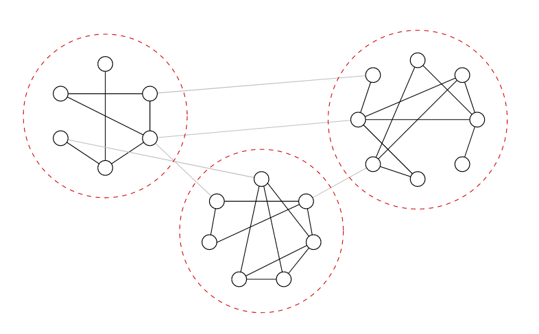
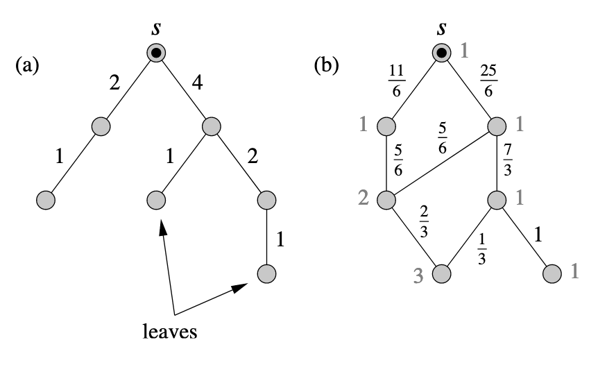
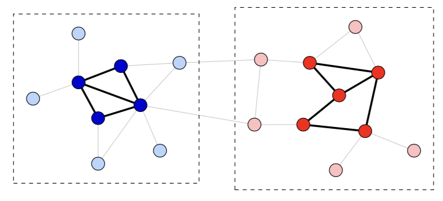
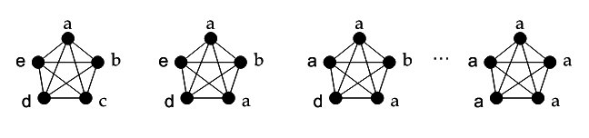
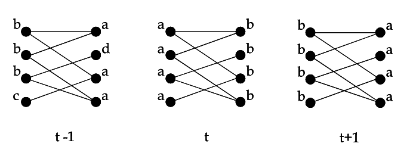
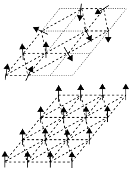
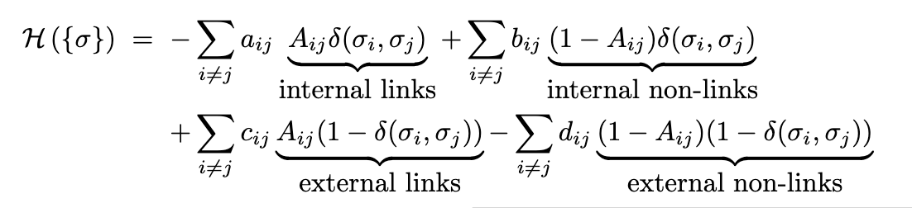

```{r setup, include=FALSE}
knitr::opts_chunk$set(echo = TRUE,fig.align = "center")
library(knitr)
library(emo)
```

# Current Status

## Gene-Gene Network Augmentation

- Last time, I presented first steps of ___snowball___, a simple gene network augmentation algorithm for literature mining

- Recently applied for TL1 grant to study scleroderma

  1) Data integration method to combine literature mining data with DNA methylation and RNA-seq
  
  2) Stochastic block model for community and hub gene detection
  
- Recently completed large data mining project to compute similarity between 186 KEGG pathways

  - We plan to apply clustering algorithms to this pathway-level data to make new insights
  
## Gene-Gene Network Augmentation

- We plan to implement the stochastic block model (SBM) and its variants 

- We will need to justify this decision by considering all available methods 

- `igraph` package in `R` is a comprehensive package for network data

  - Includes 8 community detection algorithms
  
- Learning about these is a good place to start to inform decisions about the SBM

# Community Detection in igraph

## Outline of Algorithms

1) Edge Betweenness 
2) Modularity
3) Label Propagation 
4) Leading Eigenvector
5) Multi-level Modularity
6) Optimal Community Structure
7) Spin glass Model
8) Random Walks

# Edge Betweenness

## Edge Betweenness

```{r,echo=FALSE,out.width = "150px"}

```

>  __Key Idea:__ Two communities of nodes A, and B, with dense ___intraconnectivity___ but sparse ___interconnectivity___ will be connected by a small number of edges. The shortest path from a node in A to a node in B must travel along one of these interconnecting edges.

## Edge Betweenness Definition

```{r,echo=FALSE,out.width = "200px"}

```

__Definition:__ The edge betweenness of an edge $e$ is the ___number of shortest paths___ between any pair of vertices that traverse $e$. If there are more than one shortest paths between two vertices, then assign each path equal weight. 


## Edge Betweenness Algorithm

1) Calculate the edge betweenness for all edges in the network. In a ___simple, symmetric___ and ___non-reflexive___ graph (such as a gene network), there are $n(n-1)/2$ pairs of nodes to condider. 

2) Remove the edge with highest edge betweenness from the network. 

3) Recalculate betweenness for all remaining edges. 

4) Repeat from step 2 until the graph has been partitioned into a ___bipartitie graph consisting of disjoint communities___. 

- The algorithm suggested by Newman & Girvan (2004) scales at $\mathcal{O}(mn)$, where $m$ is number of edges and $n$ is number of nodes. 

# Modularity

## Modularity

```{r,echo=FALSE,out.width = "200px"}

```

> __Key Idea:__ Given a graph in the form of an adjacency matrix, we can apply a vast number of possible community labelings to the nodes. Some community labelings are better than others depending on what we define as a good community.

## Modularity Definition

__Definition:__ Modularity is a propery of a network defined by $\mathbf{A} \in \{0,1\}^{n \times n}$ and a given community labeling $C$ on the nodes of that network. Modularity measures how well $C$ "fits" $\mathbf{A}$ in the sense that the communities have dense ___intraconnectivity___ and sparse ___interconnectivity___.

Let $Q(\mathbf{A},C)$ be the modularity of $\mathbf{A}$ and $C$. A naive definition of $Q(\mathbf{A},C)$ is

$$Q(\mathbf{A},C) = \frac{\sum_{v,w}A_{v,w}I(c_v = c_w)}{\sum_{v,w}A_{v,w}} = \frac{1}{2m}\sum_{v,w}A_{v,w}I(c_v = c_w)$$

## Modularity Definition cont...

__Problem:__ $max_C\{Q(\mathbf{A},C)\} = 1$ when all nodes are assigned to one community (i.e. $c_v = c_w$ $\forall \ v,w$).

__Solution:__ Subtract from $Q(\mathbf{A},C)$ the expected modularity under $C$ of a ___completely randomized network___. 

Let $\mathbf{A'} \in \{0,1\}^{n \times n}$ be a completely randomized network with the same dimensions as $\mathbf{A}$ ($n' = n$ and $m' = m$) and with respect to the vertex degrees of each node in $\mathbf{A}$.

What is $E[Q(\mathbf{A'},C)]$ under these restrictions?

## Modularity Definition cont...

$$E[Q(\mathbf{A'},C)]  = E\left[\frac{1}{2m}\sum_{v,w}A'_{v,w}I(c_v = c_w)\right]$$

$$\frac{1}{2m}\sum_{v,w}E\left[A'_{v,w}I(c_v = c_w)\right] = \sum_{v,w}\frac{k_v k_w}{2m}$$

where $k_v$ is the degree of node $v$.

So, revise definition of $Q(\mathbf{A},C)$ as follows.

$$Q(\mathbf{A},C) = \frac{1}{2m}\sum_{v,w}\left[A_{v,w} - \frac{k_v k_w}{2m}\right]I(c_v = c_w)$$

## Modularity Algorithm 

- Clauset et al. (2004) suggest an efficient algorithm for finding the community labeling of a network that maximizes $Q(\mathbf{A},C)$.

- In practice, the authors suggest $Q(\mathbf{A},C) > 0.3$ is indicative of a good community labeling fit. 

- Using data structures such as balanced binary trees and max heaps, the proposed algorithm scales at $\mathcal{O}(md \ log(n))$, where $d$ is the depth of the dendorgram describing the community structure. 
- In most cases networks are sparse and hierarchically structured such that $m \approx n$ and $d \approx log(n)$. In such cases the algorithm scales at $\mathcal{O}(n \ log^2(n))$

# Label Propagation

## Label Propagation

```{r,echo=FALSE,out.width = "250px"}

```


> __Key Idea:__ Suppose we wish to update the community labeling of node $\eta$. By consulting the nodes neighboring $\eta$, we can assign to $\eta$ the community label shared by the majority of its neighbors.

In the case of ties, the community labeling is chosen randomly from the tied canidate labels. 

## Label Propagation

__Synchronous updating:__ Update a label at iteration $t$ based on __all__ neighboring labels at time $t-1$.

$$c_{\eta_i}(t) = mode(c_{\eta_1}(t-1),...,c_{\eta_k}(t-1))$$

___Problem:___ Nearly bi-partite subgraphs tend to get stuck in oscillation.

```{r,echo=FALSE,out.width = "290px"}

```

## Label Propagation

__Asynchronous updating:__ Update each label at iteration $t$ from the neighbor labels that have been updated thusfar at iteration $t$ and the remaining neighbor labels from iteration $t-1$.

$$c_{\eta_i}(t) = mode(c_{\eta_1}(t),...,c_{\eta_m}(t),c_{\eta_{m+1}}(t-1)...,c_{\eta_k}(t-1))$$

- Asynchronous updating is the method proposed in Raghavan et al. (2007) and used in `igraph`.

## Label Propagation Algorithm

1) Initialize all node labels as $c_{\eta_i} = \eta_i \ \forall \ i = 1,...,n$. Thus each node is uniquely labeled. 

2) Randomly permute the order of node labels in queue to updated. 

3) Asynchronously update each node label according to the order given in (2). Break ties randomly (uniformly) as needed.

4) Stop if the node labeling $C_t \equiv C_{t-1}$. Otherwise repeat from (2).

The algorithm scales linearly in the number of edges ($\mathcal{O}(m)$).

# Leading Eigenvector

## Leading Eigenvector

> __Key Idea:__ By defining a modularity matrix to represent the difference between the number of observed edges and the number of expected edges between two nodes, we can use the eigenvalues of such a matrix to uncover community structure. 

This is related to the modularity method and is developed by the same author. 

## Leading Eigenvector 

Define the ___modularity matrix___ as $\mathbf{B} = \mathbf{A} - \mathbf{P}$. 

  - $\mathbf{A}$ is the observed adjacency matrix
  - $P_{i,j}$ is the probability that nodes $i$ and $j$ would share an edge if nodes were assigned randomly while respecting the degree of each vertex. 

As before in the modularity method, we seek to maximize $Q(\mathbf{A},C)$. For a two community graph, 

$$Q(\mathbf{A}, C) = \frac{1}{4m}C^T \mathbf{B} C$$

## Leading Eigenvector algorithm

The authors consider the leading eigenvector algorithm for the simple two community network.

1) Compute $\mathbf{B}$ as defined previously

2) Compute eigenvalues $\beta_1,...,\beta_n$ and corresponding eigenvectors $\mathbf{u}_1,...,\mathbf{u}_n$ of $\mathbf{B}$. 

3) Choose the highest eigenvalue $\beta_j$ and corresponding eigenvector $\mathbf{u}_j$. 

4) Label all nodes corresponding negative elements of $\mathbf{u}_j$ into community 1 and all nodes corresponding to positive elements of $\mathbf{u}_j$ into community 2. 

# Multi-Level Modularity

## Multi-Level Modularity

Developed by Blondel et al. (2008) to improve upon Newman's modularity algorithm. The two main improvements are

1) Run time is significantly reduced. 

2) Weighted networks are considered. 

> __Key Idea:__ The concepts of modularity and label propagation can be combined into a more sophisticated algorithm. 

## Multi-Level Modularity algorithm

1) Initialize the community labeling by assigning each node to a unique community.

2) For a given node $\eta_i$, consider the change in modularity that would occur if $\eta_i$ was assigned to the community of its neighbor $\eta_j$. Do so for all neighbors of $\eta_i$. 

3) Assign $\eta_i$ to the community of $\eta_j$ such that the gain in modularity is maximized. If no modularity gain is possible, then leave $\eta_i$ in its current community.

4) Move to node $\eta_{i+1}$ and repeat steps 2 and 3. 

5) Stop when no modularity gain is possible. 

# Optimal Community Structure

## Optimal Community Structure

Not really a separate method altogether. Brandes et al. (2008) expands upon the other modularity methods. 

- Goal is the same as previous modularity based methods: seek to find community labeling that maximizes modularity. 

- Integer linear programming is used to maximize modularity. 

- Authors establish several fundamental properties of modularity such as existence of non-trivial community labelings that maximize modularity. 

# Spin glass model

## Spin glass model 

- Comes from the physics and statistical mechanics literature (Reichardt et al. (2006))

```{r,echo=FALSE,out.width = "120px"}

```

> __Key Idea:__ Community detection can be interpreted as finding the ground state of an infinite range spin glass.

## Spin glass model

In physics, the task of finding the ground state (lowest energy state) of a system can be accomplished by minimizing a function called the ___Hamiltonian___.

__Definition:__ The Hamiltonian is an operator corresponding to the sum of the kinetic and potential energies for all particles in the system. 

```{r,echo=FALSE,out.width = "200px"}

```

In Reichardt et al. (2006), define $a_{ij}, b_{ij}, c_{ij}, d_{ij}$ as edge weights and $\sigma_i$ as community label of node $i$.

## Spin glass model estimation

- The authors choose to minimize the Hamiltonian via simulated annealing. 

- Other optimization strategies could be used as well. 

- Authors derive several expected values for a randomized network in order to get a sense for the statistical significance of a particular community labeling. 

- ___Modular___ graphs are those that lead to modularities higher than expected, but this is still not precise. 

# Walktrap

## Walktrap Method

Developed by Pons & Latapy (2005) using the idea of random walks. 

> __Key Idea:__ Random walks on a graph tend to get "trapped" into densely connected communities.

__Definition:__ A discrete random walk process (diffusion process) on a graph $G$ occurs when, at each step, a walker moves to a neighbor of its current node location according to a uniform random decision among the possible neighbors. 

## Random Walk Properties

> __Key Idea:__ The nodes visited during a random walk follow a Markov chain, where the states of the Markov chain are the nodes visited in the graph. 

__Definition:__ A Markov chain is characterized by the Markov property, which states that the state of the Markov chain at time $t+1$ depends only on the current state at time $t$. 

Let $d(i)$ denote the ___degree___ of node $i$. We can define the ___transition matrix___ $P$ of the random walk process as 

$$P_{ij} = \frac{A_{ij}}{d(i)}$$

where $P_{ij}$ denotes the probability of moving from node $i$ to node $j$ in one step. 

## Random Walk Properties

Let $D$ be the $n \times n$ diagonal matrix of vertex degrees (i.e. $D_{ii} = d(i) \ \forall i \in \{1,...,n\}$ and 0 otherwise). Then

$$P = D^{-1}A$$

__Property:__ the probability of beginning in state $i$ and ending at state $j$ after a walk of length $t$ is $P^t_{ij}$.

__Result:__ As the walk length $t \rightarrow \infty$, the probability of transitioning $i \rightarrow j$ depends only on the degree of $j$.

$$\forall i \in \{1,...,n\}, \lim_{t \rightarrow \infty} P_{ij}^t = \frac{d(j)}{\sum_k d(k)}$$

## Walktrap Distance

__Node Distance:__ For nodes $i$ and $j$, define the distance $r_{ij}$ as

$$r_{ij} = \sqrt{\sum^n_{k = 1}{\frac{(P_{ik}^t - P_{jk}^t)^2}{d(k)}}} = || D^{-\frac{1}{2}}P^t_{i \cdot} -  D^{-\frac{1}{2}}P^t_{j \cdot} ||$$

__Community Distance:__ Let $c_i$, $c_j$ be two communities. Define the distance $r_{c_i,c_j}$ as

$$r_{c_i,c_j} = \sqrt{\sum^n_{k = 1}{\frac{(P_{c_ik}^t - P_{c_jk}^t)^2}{d(k)}}} = || D^{-\frac{1}{2}}P^t_{c_i \cdot} -  D^{-\frac{1}{2}}P^t_{c_j \cdot} ||$$

## Walktrap Algorithm

1) Initialize the community labeling such that each vertex is uniquely labeled. 

2) Choose the two ___adjacent___ communities $c_i$ and $c_j$ that have minimum squared community distance. Merge $c_i$ and $c_j$ into $c_k$. Update the community labeling accordingly. 

3) Update the community distances accordingly. 

4) Repeat 2 and 3 for a pre-specified number of iterations (algorithm does not stop itself). Authors suggest t = 4 or 5. 

Average case complexity is $\mathcal{O}(n^2 \log{n})$.

# Summary

## Summary

Some thoughts to summarize...

- The eight algorithms presented here can be grouped into either modularity based algorithms or others. 

- Different algorithms tend to produce differently "shaped" communities. 

  - Further study will be required to understand this fully.
  
- Insights from statistical mechanics and stochastic processes can be fruitful for studying community detection. 

- None of these algorithms have the desirable inferential properties of the SBM. A further comparison study is warranted though. 

## Sources

See [https://carter-allen.github.io/snowball/](https://carter-allen.github.io/snowball/)

# Thank you!