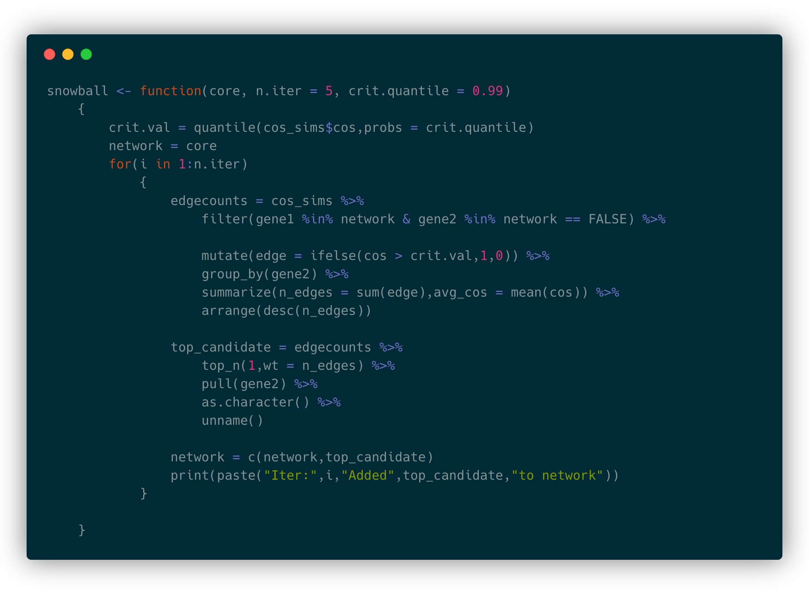

```{r setup, include=FALSE}
knitr::opts_chunk$set(echo = FALSE)
library(knitr)
library(emo)
```


# The Stochastic Block Model (SBM)

## Brief Background

- Introduced in the social science literature (Holland et al., 1983) to model social networks

- Further developed by Nowicki & Snijers (2001)

- Authors sought to develop a less _ad hoc_ way of modeling relational data

- Has been adopted in applications to network data in several domains

- Promising and flexible way to model gene networks, though not yet ubiquitous as a tool in biomedical applications

## Community Detection vs. SBM

- Some authors draw a distinction between community detection and block modeling (McDaid 2012).

- While, SBM can be used to find communities, the results are often different than in pure community detection methods.

- Many community detection algorithms seek to maximize the intra-cluster edge density. 

- SBMs can result in comparatively sparse clusters

## Definitions

___Original definition___

> _A stochastic blockmodel is a special type of probability distribution over the space of adjacency arrays._ - Holland (1983) 

\

___Modern definition___

> _The stochastic block model (SBM) is a random graph model with planted clusters. It is widely employed as a canonical model to study the statistical and computational tradeoffs that arise in network and data sciences._ - Abbe (2017)

## Definitions

The SBM is encoded by a random adjacency matrix 

$$\mathbf{A}_{n\times n} \sim SBM(n,\vec{Z},\vec{\pi},\mathbf{P})$$

- $n$: the number of nodes in the graph

- $\vec{Z}_{n\times 1} = (Z_1,...,Z_n)^T$: The random community labels of each graph, where $Z_i \in \{1,...,k\}$

- $\vec{\pi}_{k \times 1} = (\pi_1,...,\pi_k):$ The probabilities governing community labeling, where $\pi_l = P(Z_i = l)$ for $i = 1,2,...,n$ and $l = 1,2,..k$

- $\mathbf{P}_{k \times k}$ The conditional probability matrix of edges. $A_{ij} \sim Bern.(P_{Z_i,Z_j})$, where $P_{Z_i,Z_j} = P(A_{ij} = 1|\vec{Z})$

## Features of the SBM

- The graph defined by $\mathbf{A}_{n\times n}$ is _undirected_ (i.e. $\mathbf{A}_{n\times n}$ is symmetric).

- Reflexive relations are not allowed (i.e. $A_{ij} = 0 \ \forall \ i = j$)

- There are $\frac{n(n-1)}{2}$ edges possible in a graph with $n$ nodes. 

- All nodes must belong to exactly one community. More advanced SBMs allow for mixed membership. 

## Features of the SBM

- The probability that two nodes are connected with an edge _depends only on the community membership of the two nodes_. 

- In the case when $\mathbf{P}$ is constant $(P_{ij} = p \ \forall \ i,j)$, the communities become meaningless.

- The ___planted partition___ model arised when $P$ is compound symmetric. Here, the probability of an edge _within community_ and the probability of an edge _between communities_ is constant across communities.

- As $\mathbf{P} \rightarrow \mathbf{0}_{k \times k}$, $\mathbf{A}$ becomes sparse. 

## Features of the SBM

- Define $\rho_{n}$ as the probability of an edge between _two randomly selected nodes_ $\eta_1$ and $\eta_2$, members of communities $a$ and $b$, respectively. 

$$\rho_n = P(\{\eta_1 \in a\} \cap \{\eta_2 \in b \}\cap \{A_{\eta_1,\eta_2} = 1\})$$

$$ = P(\{A_{\eta_1,\eta_2} = 1\} | \{\eta_1 \in a\} \cap \{\eta_2 \in b \})$$

$$ = \sum_{a}\sum_{b} \pi_a \pi_b P_{ab}$$

- Note: $\rho_n$ is a function of $n$, the number of nodes. 

- Note: $\rho_n$ depends on $\eta_1$ and $\eta_2$ only through their community memberships.

## Features of the SBM

- Define $\lambda_n$ as the expected degree of _one randomly selected node_ $\eta$. 

$$\lambda_n = \sum_{\eta' \ne \eta}E[A_{\eta',\eta}] = (n-1)\rho_n$$

- Define $\mu_n$ as the expected number of edges in a stochastic block model.

$$\mu_n = \sum_{i = 1}^n \sum_{j > i}^n E[A_{i,j}] = \sum_{i = 1}^n \frac{\lambda_n}{2}= \sum_{i = 1}^n \frac{(n-1)\rho_n}{2}$$

$$= \frac{n(n-1)\rho_n}{2}$$

## Visualizing SBMs

- Simple program for generating an observed graph from an underlying stochastic block model with two communities. 

- This is an example of what data could be used as input to a SBM to recover communitiy memberships

- https://carter-allen.shinyapps.io/SBM2/

## Defining the Likelihood

Derived from Bernoulli likelihoods

$$L(n,\vec{Z},\vec{\pi},\mathbf{P} | \mathbf{A}) = \prod_{i<j}(P_{Z_i,Z_j})^{A_{ij}}(1-P_{Z_i,Z_j})^{1-A_{ij}} \prod_i \pi Z_i$$

$$\prod_{a \le b} (P_{ab})^{O_{ab}(Z)} (1-P_{ab})^{n_{ab}(Z)-O_{ab}(Z)} \prod_a\pi_a^{n_a(Z)}$$

Under a specific labeling $Z$, $O_{ab}(Z)$ is the number of edges between nodes labeled $a$ and $b$, $n_{ab}(Z)$ is the number of possible edges between nodes labeled $a$ and $b$, and $n_a(Z)$ is the number of nodes labeled $a$.

# Bayesian Approach to SBMs

## van der Pas & van der Vaart (2018)

- _Bayesian Community Detection_ by van der Pas & van der Vaart (2018) extends the SBM literature by outlining how one can recover estimates of class labels in a Bayesian framework

- Main results of paper is presented in section 3.2

- Authors formally argue consistency of their Bayesian estimator

- Their method ___assumes k is known!___

- Redux: By placing priors on parameters in SBM and fixing $k$, obtain joint distribution $f(\mathbf{A},\vec{Z},\vec{pi},\mathbf{P})$. Marginalize over $\vec{\pi}$ and $\mathbf{P}$ to obtain $f(\mathbf{A},\vec{Z})$ and estimate $\vec{Z}$ from $f(\vec{Z}|\mathbf{A})$

## Prior Structure

- The authors change notation from $Z$ to $e$, reserving $Z$ for the frequentist setting. 

$$\pi \perp (P_{ab})$$
$$\pi \sim Dir(\alpha,...,\alpha)$$ (often $\alpha = 1$)

$$P_{ab} \stackrel{iid}{\sim} Beta(\beta_1,\beta_2), \ 1 \le i \le j \le k$$

$$e_i|\pi,P \stackrel{iid}{\sim} \pi, \ \ 1 \le i \le n$$

$$A_{ij}|\pi,P,e \stackrel{indep.}{\sim} Bern.(P_{e_i},P_{e_j}), \ \ \ 1 \le i \le j \le n$$

## Posterior inference

The authors claim that 

$$Q_B(e) = \frac{1}{n^2} \sum_{1 \le a \le b \le K}logB(O_{ab}(e) + \beta_1,n_{ab}(e)-O_{ab}(e)+\beta_2)$$
$$+ \frac{1}{n^2}\sum_{a = 1}^K log \Gamma(n_a(e) + \alpha) \propto p(e|\mathbf{A})$$

$$\Rightarrow \hat{e} = \underset{e}{\operatorname{argmax}}  \ Q_B(e)$$

(i.e. Bayesian estimator is the posterior mode)

# Computational Issues in SBMs

## McDaid et al. (2013)

- Little detail is given in van der Pas & van der Vaart (2018) as to how computation is performed

- Authors refer the reader to _Improved Bayesian inference for the stochastic block model with application to large networks_ by McDaid et al. (2013).

- An effecient algorithm in `C++` for estimating ___both___ the number of clusters and community membership 

https://sites.google.com/site/aaronmcdaid/sbm

## Computational issues

- Letting `K` be decided by the data introduces complexity

- MCMC is now concerned with estimating $Z$ and $K$

- Searching over a space whose dimension depends on $K$ can be challenging

# Applying SBMs to Network Augmentation

## Refresh on Network Augmentation

 _Several possible sources of information for learning about relationships between genes:_

1) Manually curated database such as ___KEGG___ (Kyoto Encyclopedia of Genes and Genomes)

    - Reliable/validated baseline information

    - Difficult to scale
    
2) Literature mining database such as ___GAIL___

    - Easily scalable
    
    - Can suggest previously un-investigated relationships
    
## Snowball method

<center>

```{r,out.width="80%"}

```

</center>

## Network Augmentation with SBMs

- One key issue: ___the stochastic block model does not propose new members___

- The SBM can estimate community structure ___based only on observed interconnectivity of edges in a network___

- One possible solution

  1) Fit SBM to core network (e.g. KEGG pathway)
  2) Use `snowball.R` to suggest new members via cosine similarity
  3) Refit SBM and observe community membership of new member
  
## Network Augmentation with SBMs 

- Another possible approach

  1) Generate list of potential members _a priori_
  2) Let $Z_i \in \{1,2\} \ \forall \ i = 1,2,...,n$ (i.e. two possible classes)
  3) Place strong priors on $Z_i \ \forall \ i \in \mathbf{C}$, where $\mathbf{C}$ is core set.
  4) Place priors on remaining candidates proportional to their average connectivity to $\mathbf{C}$
  5) Observe adjacency matrix $A$ after some number of interations of `snowball.R`
  6) Fit SBM to observed $A$ under such prior structure
  
## Weighted SBMs

- Work has been done by Christopher Aicher of University of Colorado, Boulder, and others, to incorporate edge weights in the stochastic block model

___References on WSBMs___:

  1) _Adapting the Stochastic Block Model to Edge-Weighted Networks_, Aicher, C. et al. 2013.

  2) _Learning Latent Block Structure in Weighted Networks_, Aicher, C. et al. Journal of Complex Networks. 2014. 

These models might allow us to incorporate cosine similarity information as edge weights. 

<<<<<<< HEAD
# Summary

## Summary

- SBMs provide a promising and flexible framework for modeling network data

- Some work will need to be done to develop a method suitable for GAIL data

- Next steps are to running models on test data and observing performance

=======
>>>>>>> 62cbbf33f49ef339fc7a94d79c665493db6bfb37
## References

- _Bayesian Community Detection_. S. L. van der Pas & A. W. van der Vaart. Bayesian Analysis. 2018.

- _Stochastic Block Models, First Steps_. Holland, P et al. Social Networks. 1983. 

- _Blockmodels: A R-package for estimating in Latent Block Model and Stochastic Block Model, with various probability functions, with or without covariates_. Leger, J.-B. Journal of Statistical Software. 2016.

- _Adapting the Stochastic Block Model to Edge-Weighted Networks_, Aicher, C. et al. 2013.

- _Learning Latent Block Structure in Weighted Networks_, Aicher, C. et al. Journal of Complex Networks. 2014. 