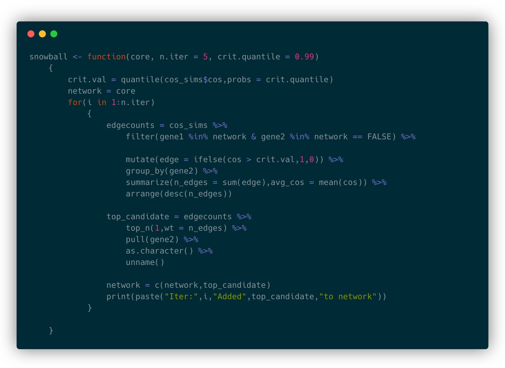

```{r setup, include=FALSE}
knitr::opts_chunk$set(echo = FALSE)
library(knitr)
library(emo)
```

## Outline 

1) Introduction

2) A relevant paper: ___Maneck et al. (2011)___

    - Will focus on the methods in the interest of time

3) First steps (so far)

    - Please share feedback and ideas!

## Introduction

- _Several possible sources of information for learning about relationships between genes:_

1) Manually curated database such as ___KEGG___ (Kyoto Encyclopedia of Genes and Genomes)

    - Reliable/validated baseline information

    - Difficult to scale
    
2) Literature mining database such as ___GAIL___

    - Easily scalable
    
    - Can suggest previously un-investigated relationships
    
## Maneck et al. (2011) - Motivation

- Sought statistical tools for integration of experimental data with patient data

- Combining patient samples with genomic profiles from experiments in cell lines/animal models

- "Each profiling technology sheds different, and partly complementary light on the functioning and malfunctioning of cells. However, their joint full potential can only be realized when the two information sources are combined."

## Maneck et al. (2011) - Intoduction

- When combining sources of biomedical information, a key issue is the development of a statistical framework to account for heterogeneities among data sources. 

- Problems with combining biomedical data sources include:

    - Data result from different experimental setups/study designs
    
    - Heterogeneity in profiling platforms
    
    - Lack of documentation and instruction to recreate previous analyses
    
## Maneck et al. (2011) - Intoduction

- ___Guided clustering:___ a novel data integration method introduced by the authors.

    - Combines experimental data with high-throughput data of possibly different genomic data type
    
    - Provides predictions of pathway activation
    
    - The mixing between data sources can be tuned by user
    
## Maneck et al. (2011) - Algorithm: step 0

- Authors demonstrate guided clustering with an application to oncogenic pathway activation in tumor samples

- _Guiding data_ $G$ is an $k \times n$ matrix with genes as rows and samples as columns. 

$$G = \begin{bmatrix} g_{11} & g_{12} & \cdots & g_{1n} \\ g_{21} & g_{22} & \cdots & g_{2n} \\ \vdots & \vdots & \ddots & \vdots \\ g_{k1} & g_{k2} & \cdots & g_{kn} \end{bmatrix}$$

- Similarly matrix $T$ gives tumor expression profiles. 

    - Note the assumption that rows of $G$ and $T$ are the same
    
## Maneck et al. (2011) - Algorithm: step 1

- Compute similarity matrices $A_T$ and $A_G$ for $G$ and $T$, respectively

$$A_T(g,h) = exp \left ( \frac{-(1-\omega)d(g,h)^2}{2\sigma^2} \right )$$

- This is a Gaussian smoothing kernel where 

    (i) $d(g,h) = 1 - max(\rho(g,h),0)$
    
    (ii) $\sigma$ defines "bandwidth" of Gaussian smoothing process
    
    (iii) $\omega$ is a tuning parameter that adjusts balance between data sources
    
## Maneck et al. (2011) - Algorithm: step 1

- With two similarity matrices $A_T$ and $A_G$, "fuse" to form $W$

$$W = A_G^{1/2} A_T A_G^{1/2}$$

- $W$ is a symmetric similarity matrix. 

    - High values when a pair shows consistent expression in $T$ and respond to pathway activation in $G$
    
## Maneck et al. (2011) - Algorithm: step 2

- The next step in guided clustering is to calculate the _neighborhood density_ $K(g)$ for each gene $g$. 

$$K(g) = \sum_{i = 1}^n W_{g,i}$$

- Note that a large $K(g)$ indicates $g$ is in a large/dense cluster

## Maneck et al. (2011) - Algorithm: step 2

- Algorithm selects $g_0$ such that $K(g)$ is maximized as "seed" gene. 

- Next, the module of genes $C$ is grown iteratively by adding $g_{k+1}$ such that

$$\gamma(g_0,g_1,...,g_k,g_{k+1}) = \frac{\sum_{i,j \le k+1} W_{g_i,g_j}}{|C|+1}$$

is maximized.

- Algorithm terminated once there is no gene $g_{k+1}$ such that 

$$\gamma(g_0,g_1,...,g_k,g_{k+1}) > \gamma(g_0,g_1,...,g_k)$$

## Maneck et al. (2011)

- The authors proceed by validating the algorithm via simulation and provide two application studies

- The supplemetary materials contain discussion on identifying tuning parameters

- `R` package available (https://genomics.ur.de/software/guidedClustering)

## Network Augmentation - Approach 1

- From KEGG pathway, define "core" gene set

$$C = \{ c_1, c_2,...,c_n \}$$

- From GAIL, define set of all possible additions to core set (i.e. all genes in GAIL not in $C$)

$$G = \{g_1,g_2,...,g_n \}$$

- Compute cosine similarity $s_{ij}$ for all pairs $(c_i,g_j)$.

- Add to network $g_{ij}$ with $max(s_{ij})$.

## Approach 1 

1) Start with `cos_sims`, a data frame with cosine similarities for all pairs of genes

2) Define a vector `core_set` with the names of core KEGG genes

3) Filter `cos_sims` such that column 1 contains all genes in `core_set` but column 2 contains all genes not in `core_set`

4) Sort by cosine similarity (descending)

5) Choose the top candidate gene (row 1 column 2) to add to the `core_set`

6) Repeat until sensible stopping condition

## Approach 1: Apoptosis Application

- ___apoptosis___: genetically controlled mechanisms of cell death involved in the regulation of tissue homeostasis.

- `KEGG_APOPTOSIS` contains 88 genes involved in apoptosis

- Using this simple approach 1, GAIL suggests:
  
    1) __TRAF2__ $\rightarrow$ __TANK__ ($s_{ij} = 0.993$, $Pr(S \ge s_{ij}) \approx 0.0004$)
        - __TANK__ encodes a protein that is found in the cytoplasm and can bind to TRAF1, TRAF2, or TRAF3, thereby inhibiting TRAF ([GeneCards](https://www.genecards.org/cgi-bin/carddisp.pl?gene=TANK&keywords=TANK))
        
    2) __RIPK1__ $\rightarrow$ __RALBP1__ ($s_{ij} = 0.882$, $Pr(S \ge s_{ij}) \approx 0.0009$)
    
        - __RIPK1__ has been found to be associated with lung cancer ([GeneCards](https://www.genecards.org/cgi-bin/carddisp.pl?gene=RALBP1&keywords=RALBP1))
        
## Approach 1: Cell Cycle Application

- `KEGG_CELL_CYCLE` contains 128 genes

- GAIL suggests:

    1) __RBL2__ $\rightarrow$ __RAB3GAP1__ ($s_{ij} = 0.980$, $Pr(S \ge s_{ij}) \approx 0.0004$)
    
        - __RBL2__ ecodes protein which regulates the activity of members of the Rab3 subfamily of small G proteins ([GeneCard](https://www.genecards.org/cgi-bin/carddisp.pl?gene=RAB3GAP1&keywords=RAB3GAP1))
        
    2) __ANAPC4__ $\rightarrow$ __SLC25A41__ ($s_{ij} = 0.95$, $Pr(S \ge s_{ij}) \approx 0.0006$)
    
        - __SLC25A41__ solute carrier protein coding gene ([GeneCard](https://www.genecards.org/cgi-bin/carddisp.pl?gene=SLC25A41&keywords=SLC25A41))

## Approach 2

- Define $C$, $G$, and $S$ as in Approach 1.

- Define $\kappa$ a cosine similarity cutoff needed to form an edge between two genes

- For each pair $(c_i,g_j)$ define indicator $e_{ij} = 1_{s_{ij} > \kappa}$

- For each $g_j$ compute $n_j = \sum_i e_{ij}$, number of edges from $g_j$ to current network

- Add $g_j$ to network such that $n_j$ is maximized

## Approach 2

<center>

```{r,out.width="80%"}

```

</center>

## Approach 2: Apoptosis Application

- GAIL suggests:

    1) __DIABLO__ 
    
        - Encodes an inhibitor of apoptosis protein (IAP)-binding protein ([GeneCard](https://www.genecards.org/cgi-bin/carddisp.pl?gene=DIABLO&keywords=DIABLO))
        
    2) 4-way tie between __BIRC3__, __DFFB__, __FASLG__, __KRR1__
    
        - Approach 2 currently adds all ties to the network!
        
## Approach 2: Cell Cycle Application

- GAIL suggests:

    1) __CKS1BP7__ 
    
        - A "pseudogene" associated with multiple myeloma among others ([GeneCard](https://www.genecards.org/cgi-bin/carddisp.pl?gene=CKS1BP7&keywords=CKS1BP7))
        
    2) 11-way tie between __CCNA2__,__CCNE1__,__CDC25A__,...
    
## Subset Analysis

- A possible way to validate network augmentation methods 

    - Take a list of genes from KEGG
    - Randomly sample a subset from that network
    - Use random subset as seed for augmentation method
    - Check to see if augmentation method adds back in the excluded genes from original network

## Subset Analysis: Apoptosis

- Define `apop_genes` as all genes in `KEGG_APOPTOSIS`
- Let `apop_genes_sub <- sample(apop_genes,k)`
    - Choose a few different values for `k`
- Then `apop_excl <- setdiff(apop_genes,apop_genes_sub)` are the genes we hope to recover with network augmentation

## Subset Analysis: Apoptosis


```
apop_aug <- snowball(apop_genes_sub,
    n.iter = 5,
    crit.quantile = 0.95)
```

```
[1] "Iter: 1 Added DIABLO to network"
[1] "Iter: 2 Added FASLG to network"
[1] "Iter: 3 Added MAPK9 to network"
[1] "Iter: 4 Added FADD to network"  "Iter: 4 Added RIPK1 to network"
[1] "Iter: 5 Added CASP2 to network"  "Iter: 5 Added RALBP1 to network"
```

```
intersect(apop_excl,apop_aug)
```

```
'FADD' 'FASLG' 'RIPK1'
```

- _Added 7 genes, of which 3 were in the original KEGG network_. 

## Subset Analysis: Apoptosis

- Quantities of interest

    1) ___True positives___: No. of genes in `apop_excl` that were added by augmentation
    2) ___False positives___: No. of genes not in `apop_excl` that were added 
    3) ___False negatives___: No. of genes in `apop_excl` that were not added
    4) ___True negatives___: No. of genes in GAIL, but not in `apop_genes` that were added

## Subset Analysis: Apoptosis

```{r,echo=FALSE}
r1 <- c(3,4,7)
r2 <- c(26,20060,20086)
r3 <- c(29,20064,20093)
res.df <- as.data.frame(rbind(r1,r2,r3))
colnames(res.df) <- c("In target set","Not in target set","Total")
rownames(res.df) <- c("Added","Not added","Total")
kable(res.df,caption = "Number of iterations: 5")
```

- These results are highly dependent on the number of iterations $\rightarrow$ need for sensible stopping conditions

## Summary

- Approach 1 allows for easy formulation of statistical properites because it

    - Retuns $s_{ij}$ for each step $\rightarrow$ easily compute p-values and FDR 
    
    - Avoids ties by continuity of $s_{ij}$ 
    
    - Only takes into account information from one gene in the network at a time 
    
## Summary

- Approach 2 may propose more highly connected candidate genes because it

    - Takes into account information from _all_ genes in current network 
    
    - However, statistical properties will take more work to formulate since
    
        - Edge counts arise from aggregation of many cosine similarities
        
        - Threshold choice can be arbitrary
        
        - Many ties at each step can introduce higher error rates
        
## Going Forward

- First step will be to better specify the algorithm itself
    - Stopping condition
    - Thresholds
    - etc...
    
- Then we can come up with a statistical framework
    - Specify a generative model that describes the algorithm
    - Bayesian setting
        - Latent class memberships
        - Direct posterior probability approach